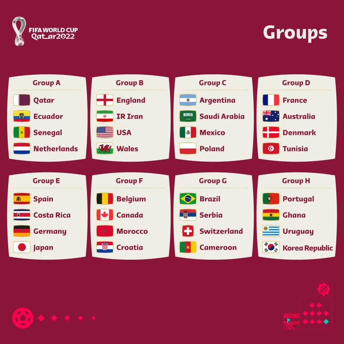

# FIFA-World-Cup-Qatar-2022
<br>

<p align="center">

</p>
<br>

Football is one of the most famous and well-known sports around the globe. Born in 1863 in England, this kind of sport has a lot of fans worldwide.

The football **World Cup** is one the biggest global events that are hosted once every four years by a specific country where many qualified teams compete to win the **World Cup** title.

The 20th of November 2022, has been an extremely important day for football fans around the globe. This day marks the beginning of the World Cup 2022 and for the first time, it is hosted by Qatar which is a small country but bigger than you ever thought.


 
<br>

# Table of Contents
<br>

1. [Overview](#overview)
2. [Installation:](#installation)
3. [File Description](#file-desc)
4. [Results](#results)
5. [Next Steps](#next)
6. [Acknowledgments](#acknowledgments)


### Overview: <a name="overview"></a>
<br>

In this project, I worked on predicting the winner of the group-stage games using a multi-class classifier that uses multiple data sources to classify game results into 3 categories (Home,Draw, and Away).
<br>
<p align="center">

</p>
<br>

I also wrote an [article](https://medium.com/@aminebenneji/world-cup-qatar-2022-group-stage-winners-you-didnt-know-about-d720fed4d98f) on **Medium** where I detailed the steps to implement this project and listed the results that I got.


### Installation:  <a name="installation"></a>
<br>

1. First you need to clone the repository to your local machine using this command:

    ```
    git clone https://github.com/aminebennaji19/FIFA-World-Cup-Qatar-2022.git
    ```

2. After cloning the repository, you need to install the install the project requirements.

- **PS**: This project was developed using **Python3.7**
    
    ```
    pip3 install -r requirements.txt
    ```
<br>

### File Description <a name="file-desc"></a>
<br>


* [**data**](data/): Folder containing the data files.

    * [**1-World_cup2022.csv**](data/1-World_cup2022.csv): The World Cup player 2022 stats dataset.
    * [**WorldCups.csv**](data/WorldCups.csv): The World Cup achievements dataset.
    * [**fifa_ranking-2022-10-06.csv**](data/fifa_ranking-2022-10-06.csv): The Fifa rankings dataset.
    * [**results.csv**](data/results.csv): The International football results dataset.

* [**results**](results/):Folder holding the results of our prediction and the best model.

    * [**best_classifier.pkl**](results/classifier.pkl): The exported model pickle file.
    * [**remaining_group_stage_games_world_cup_2022.csv**](results/remaining_group_stage_games_world_cup_2022.csv): The exported model pickle file.


* [**figures**](figures/): Folder including the necessary images for the Readme file.

* [**requirements.txt**](/requirements.txt): The project requirements file.

* [**World-Cup-2022-Predictions.ipynb**](World-Cup-2022-Predictions.ipynb): 
        Jupyter Notebook including the World Cup 2022 group stage predictions.

<br>

### Results <a name="results"></a>
<br>

In this project:

- We Explored, pre-processed and prepared the data to use following the ETL (Extract, Transform, Load) process.

- We Trained, evaluated, tested and optimized the classifier on test data and a held-out test split (world cup games).
- We Fine-tuned the model to improve its performance.
- We Predicted the winners of the group stage phase.

Take a look at this [blog](https://medium.com/@aminebenneji/world-cup-qatar-2022-group-stage-winners-you-didnt-know-about-d720fed4d98f) to understand what we did in details and also on the code implementation.


### Next steps: <a name="next"></a>
<br>

The results that we had are the very first results and can be improved in the near future by one of these potential solutions:

- Add, and clean more data where we can study the outliers, and the skewness of the data and consider the balance of the classes.
Use more potential data sources like the latest player stats to include performance indicators for each team.

- Include the already-played game results of the group stage of this edition into the training set maybe they’ll add something beneficial to conclude the World Cup winner.

- Deploy this work on a web application to showcase its added value.


<br>

### Acknowledgments: <a name="acknowledgments"></a>

<br>

This project is the final part of the [**Udacity Data Science Nanodegree program**](https://www.udacity.com/course/data-scientist-nanodegree--nd025?utm_source=gsem_brand&utm_medium=ads_r&utm_campaign=12949497746_c_individuals&utm_term=130336578188&utm_keyword=data%20scientist%20nanodegree_e&gclid=Cj0KCQiAgribBhDkARIsAASA5bvkUHaXzaZyn66isK3HJReKaCFeYsvd6tCYfnhLYGFRGuv1KEiW69kaAh9kEALw_wcB) that is really helpful and practical. I would like to dedicate this work to [Kaggle](https://www.kaggle.com/) for sharing the data and findings between members and make everything possible by unlocking the hidden secrets of data.


Feel free to use this code, sharing it with the community and contact me on [LinkedIn](https://www.linkedin.com/in/mohamed-amine-bennaji/) if there's anything related to this project.